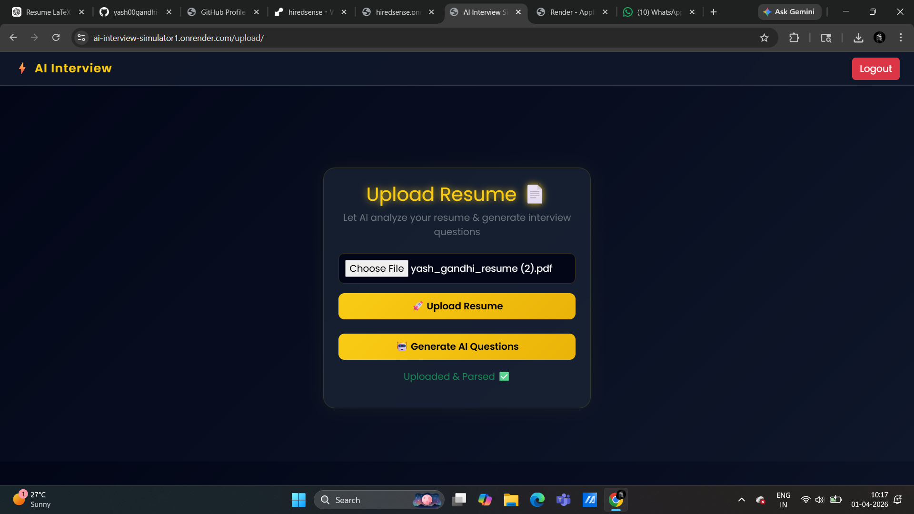
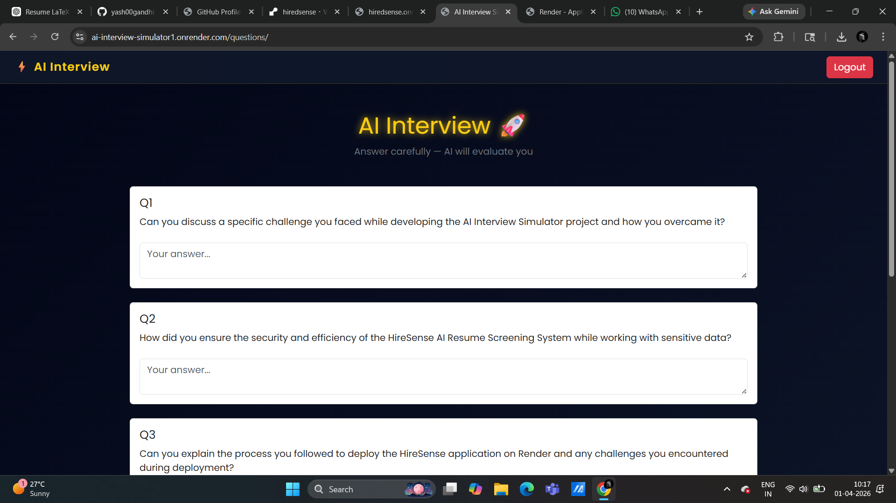
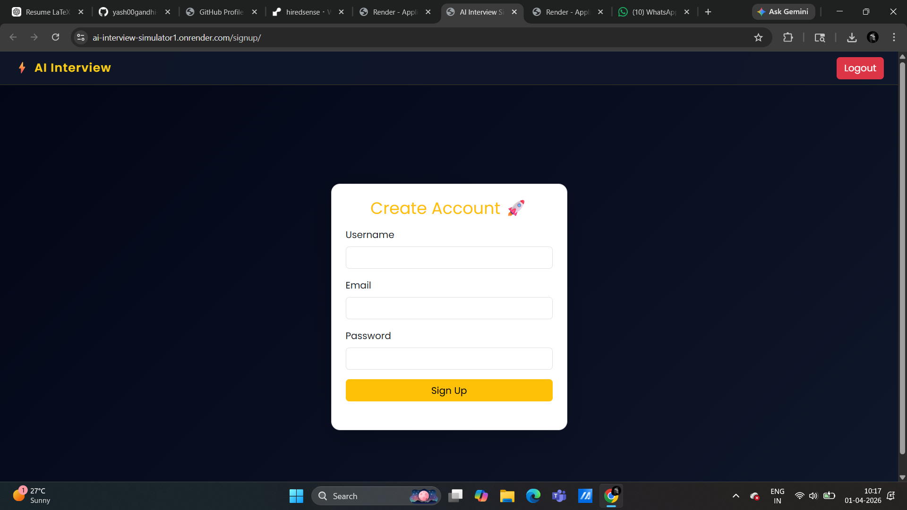
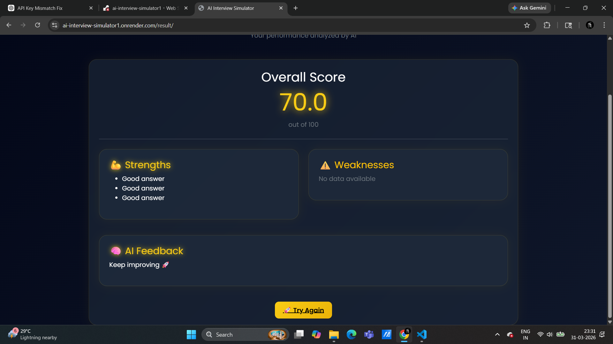

 AI Interview Simulator

This is a project I built to solve a simple problem — practicing interviews is hard when you don’t have someone to take them seriously.

So I tried to simulate that experience using AI.

The idea is straightforward:
You upload your resume, the system reads it, generates interview questions based on your profile, and then evaluates your answers.

 How it works

* User signs up
* Uploads resume (PDF)
* System extracts text from it
* AI generates questions based on the resume
* User answers them
* AI evaluates answers and gives score + feedback

 Tech Stack

* Django (Backend)
* HTML, CSS, JS (Frontend)
* OpenRouter API (for AI)
* pdfplumber (for resume parsing)

 Features

* Resume-based question generation
* AI-powered answer evaluation
* Score + feedback system
* Simple and clean UI
* Fully working end-to-end flow

 Why I built this

I wanted something more than a basic CRUD project.
This combines backend logic + real AI integration, which makes it closer to a real-world product.

Also, I personally felt the need for something like this while preparing for interviews.

 Current Status

Project is functional and deploy-ready.
Still open to improvements like:

* Better UI/UX
* More accurate evaluation
* Voice-based interview mode

 Run locally

bash
git clone <repo>
cd project
pip install -r requirements.txt
python manage.py runserver

Final note

## 📸 Screenshots

### Resume Upload

### Generated Questions

### Answer Section

### Result

This project is more about solving a real problem than just showcasing code.
Still improving it as I learn more.
